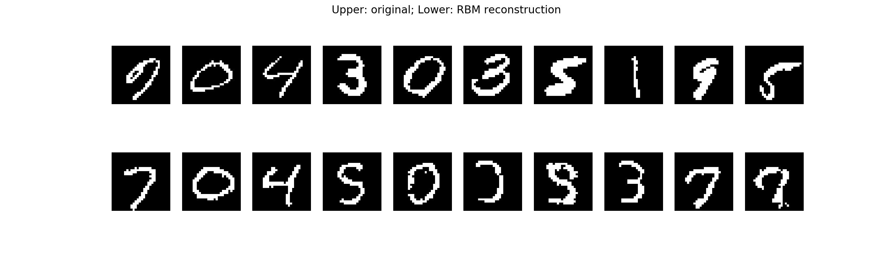
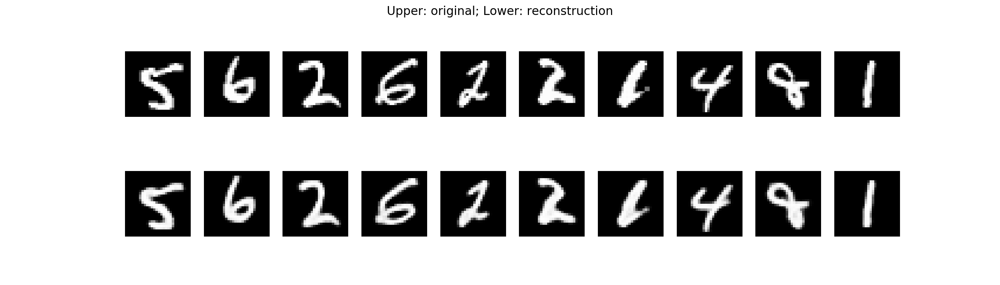

Tensorflow Model Excercises
===========================
The repo contains my personal excerises in implmenting some common
neural network models with tensorflow.

The algorithms mostly follow the [deep learning tutorial](http://deeplearning.net/tutorial/), which inlcudes:
- Logistic Regression
- Multi-layer Perceptron (MLP)
- Deep Belief Net (DBN)
- Restricted Boltzmann Machine (RBM)

- Denoising Autoencoder

